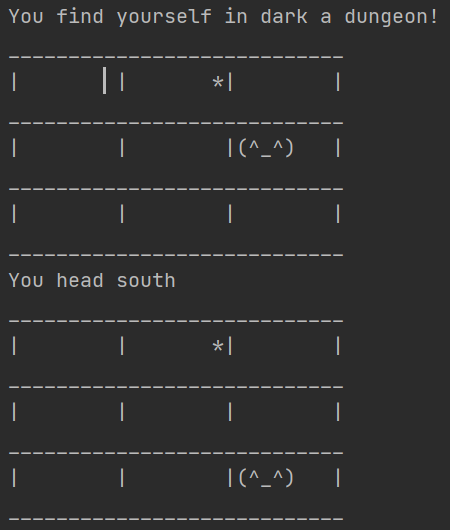

# Übung 1: Blinder Schatzsucher

In dieser Übung wollen wir ein kleines Spiel implementieren.

Stell dir vor, dass ein Schatzsucher sich in einem dunklen Verlies befindet.
Er kann seine Umgebung nicht wahrnehmen und ist gezwungen sich in eine zufällige Richtung zu bewegen.

Dieses Scenario können wir nun in verschiedene Akteure bzw. Klassen aufteilen:
* ```Player```: Klasse für den Spieler bzw. Schatzsucher.
* ```Goal```: Klasse für das Ziel bzw. Schatz.
* ```Room```: Klasse für eine Flächeneinheit des Feldes.
* ```Fieldhandler```: Klasse für die Verwaltung des Spielfelds oder anders gesagt bestimmt die Spielregeln.
* ```Game```:Main-Methode so wie Spielablauf.

## Goal
Implementiere die Klasse Goal für den Schatz:
- Einen String namens icon, diese Zeichenkette repräsentiert den Schatz auf der Konsole.
- Position auf der X-Achse.
- Position auf der Y-Achse.
- Construktor und get()-Methoden dieser Felder.

## Player
Für die Implementation der Klasse Player, die den Schatzsucher repräsentiert, können wir dasselbe wie bei Goal machen.
Damit unser Schatzsucher sich auf dem Spielfeld bewegen kann, brauchen wir hier noch set()-Methode um die XY-Werte zu manipulieren.

## Room
Die Klasse Room repräsentiert ein Kästchen/Tile des Spielfeldes, worauf sich der Schatzsucher und der Schatz befinden können.
Somit braucht die Klasse Felder um sich diese Zustände wie z.B. boolean playerimraum=true/false zu merken, so wie get()- und set()-Methoden.

## Fieldhandler
Da wir nun alle unsere Einzelteile definiert haben, ist es nun an der Zeit eine Klasse zu implementieren,
welche die Kommunikation zwischen den Klassen übernimmt:

- Die Hauptakteure Player schatzsucher und Goal schatz dürfen nicht fehlen.
- Das Spielfeld ist eine quadratische Matrix, dargestellt durch ein zweidimensionales Array unserer Klasse Room.
- Ein Feld zum Merken der Spielfeldgröße (bei unserer Matrix ist Länge==Breite);
- private final char[] directions = {'n', 's', 'w', 'e'}; einen konstanten Datensatz für die Himmelsrichtungen.
- private static Random rand = new Random() ein Zufallszahlen generator. Mit der Funktion rand.nextInt(int parameter) wird eine Zahl zwischen 0 und parameter-1 generiert z.B. rand.next(50) => 0-49.
- Im Constructor Fieldhandler(spielfeldgröße) können nun die Positionen des Suchers und des Schatzes gesetzt werden, ich empfehle dies vorerst nicht durch eine Zufallszahl zu setzten.

### public void init()
Initialisiert die Räume des Arrays und setzte die Zustände der Räume.

### public void draw_field()
Zeichnet das gesamte Spielfeld.
So könnte z.B die Ausgabe aussehen:




### public void move_adventurer() 
- Bewegt den Schatzsucher zufällig in einer der 4 Himmelsrichtungen.
- Falls der Schatzsucher gegen eine Wand(Randpunkte der Matrix) läuft, schreckt er zurück und läuft rückwarts in die entgegen gesetzte Himmelsrichtung.
- Setzt den Status des Raumes wo sich der Sucher befindet auf true.

### public boolean treasure_found()
Berichtet, ob sich Schatz und Schatzsucher im selben Raum befinden.

## Game
main-Methode und Spielablauf.
Probier vielleicht erstmal einzelne Anweisungen bevor du eine Ablaufschleife oder auch Game Loop schreibst.

## <span style="color:orange">*Bring deine eigene Würze ein!*</span>
Sei es ein neues Feature, Gestaltung der Konsolenausgabe oder du hast Anregungen zu deinem eigenen Projekt bekommen. Wir würden uns freuen, wenn du deine Erkenntnisse mit uns teilen möchtest.
